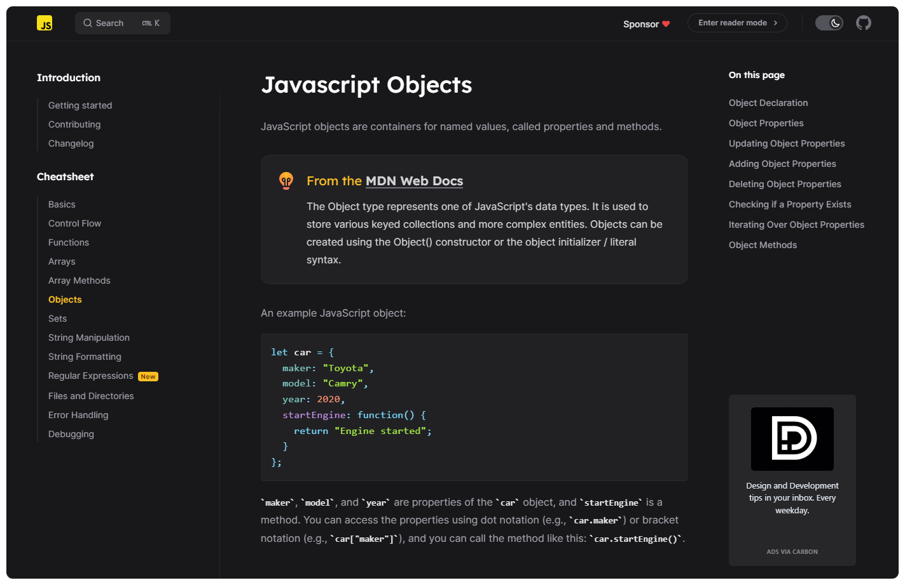

<h1 align="center">javascript Cheatsheet</h1>

  <a href="https://www.javascriptcheatsheet.org/">javascriptcheatsheet.org</a> |
  <a href="https://github.com/wilfredinni/javascript-cheatsheet/blob/master/src/pages/contributing.md">Contribute</a> |
  <a href="https://github.com/wilfredinni/javascript-cheatsheet/blob/master/src/pages/changelog.md">Changelog</a>

Anyone can forget how to
[make character classes](https://www.javascriptcheatsheet.org/cheatsheet/regular-expressions#making-your-own-character-classes)
for a regex, [slice a list](https://www.javascriptcheatsheet.org/cheatsheet/array-methods#array-slice) or do a [for loop](https://www.javascriptcheatsheet.org/cheatsheet/control-flow#for-loop). This javascript cheatsheet tries to provide basic reference for beginner and advanced developers, lower the entry barrier for newcomers and help veterans refresh the old tricks.

## Contributors

Made with [contrib.rocks](https://contrib.rocks).

